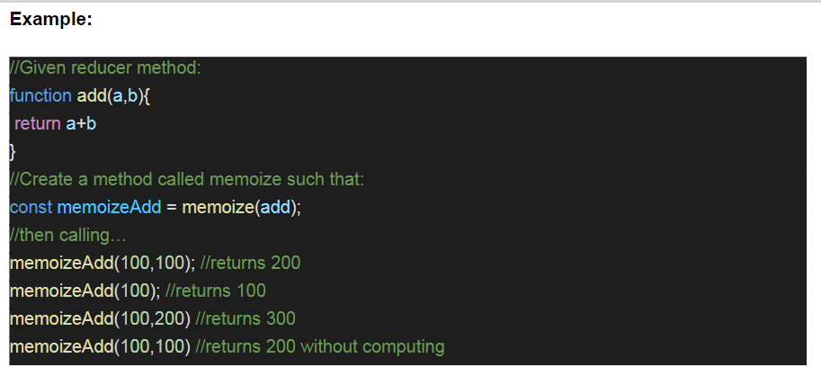
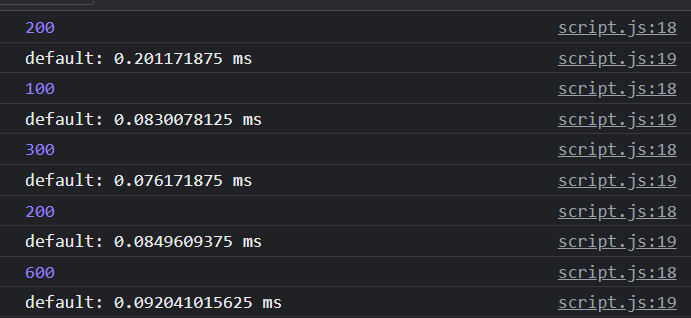

# Pesto Assignments

Week 3 assignment.

# Memoization

Exercise 3.1:

- Create a memoize function that remembers previous inputs and stores them in cache so that itwon’t have to compute the same inputs more than once. The function will take an unspecifiednumber of integer inputs and a reducer method.

# Expected Result

# Actual Result

