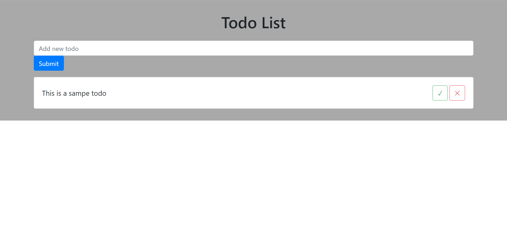

## Week 9 assignment

- Create a ToDo List Application in React.
- Once Application Starts, the user should see a List of todos and an optionto add a new todo.
- Once the user completes a todo, the user can check mark the todo and it should be marked as completed.
- For reference you can see Google Keep and try to understand the UXdesign.
- Use Create React App to generate starter files.
- Push it to the github repository.
- Include a .ReadMe file with steps to run the project.

# Benchmarks:

- 1.There should be a separate branch created in GitHub for this exercise.
- 2.The Project should include a ReadMe File which will lists down all thecommands clearly for running application on local
- 3.Application should adhere to component architecture and should havemeaningful component hierarchy
- 4.Application should handle all the validations. For example blank todo
- 5.There should be one or more Git commits with meaningful commitmessages.

# Output :

- Homepage :
  
- Add new todo :
  
- Todo complete :
  
- Delete todo :
  

# Getting Started with Create React App

This project was bootstrapped with [Create React App](https://github.com/facebook/create-react-app).

## Available Scripts

In the project directory, you can run:

### `npm start`

Runs the app in the development mode.\
Open [http://localhost:3000](http://localhost:3000) to view it in your browser.

The page will reload when you make changes.
